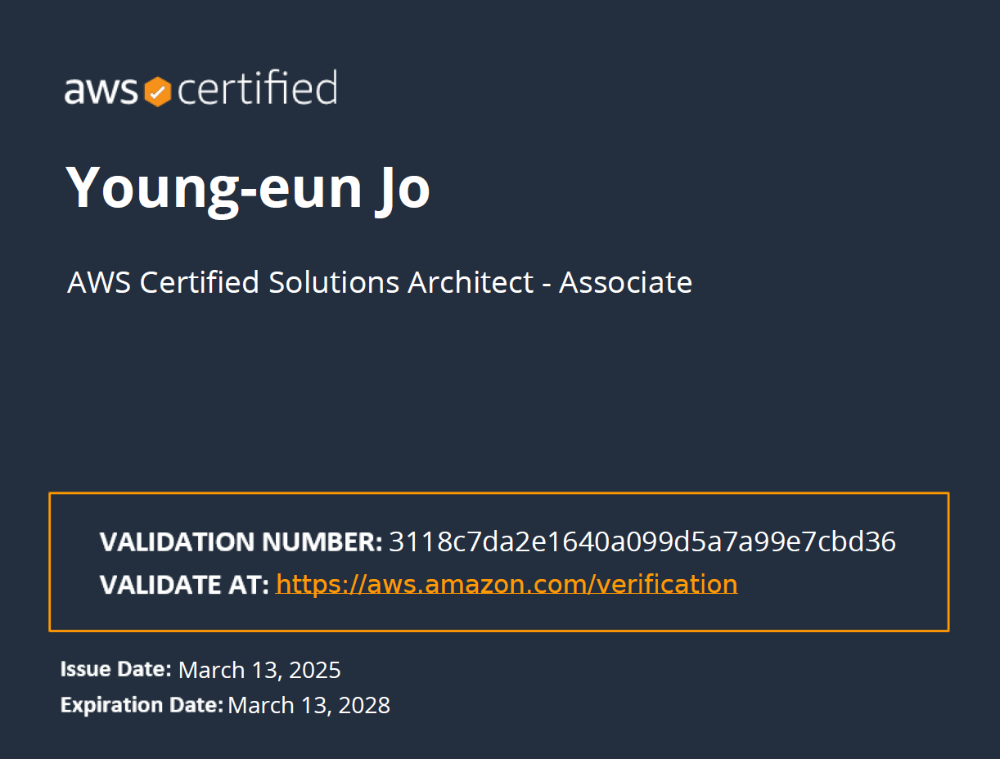
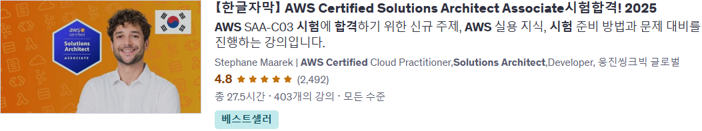
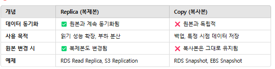
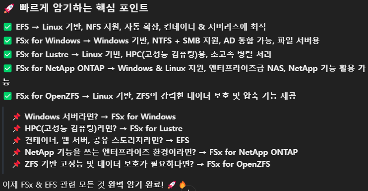
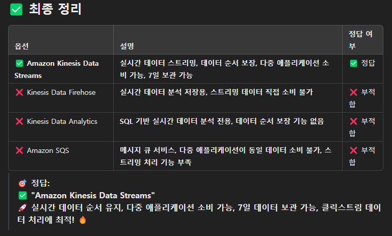

나름 열심히 공부했던것 같다.
전체적으로 AWS 인프라에 대한 흐름을 알 수 있어서 유익했다.

여태껏 본 AWS 시험을 비교해보자면
DVA > SAA > > > CLF 다.

이번에도 시험시간 160분 중 160분 다 쓰고 나왔는데, 생각보다 결과가 잘 나와줘서 놀랐다.

시험 다 보고 집 가는길에 엄청 걱정만 했는데 말이다.

---

## 시험안내

최소 720점 이상을 맞아야 합격이고 총 65문제 중 15문제는 채점에 포함되지 않는 문제들이다.

대략적으로 채점 대상인 50문제 중 36 ~ 37문제를 맞추어야 최소 커트라인인 것이다.

이번에도 마찬가지로 자세한 사항은 [SAA-C03 시험 안내서](https://d1.awsstatic.com/ko_KR/training-and-certification/docs-sa-assoc/AWS-Certified-Solutions-Architect-Associate_Exam-Guide.pdf)를 참고하면 된다.

조금 의아했던게

분명히 복수 응답형에는 5개중 2개 정답이 있다. 라고 적혀있는데

막상 시험에는 6개중 3개 정답을 고르라는 문제가 있었다.

문서가 잘못된건지 아니면 내가 문서를 덜 알아본건진 모르겠다.

### 만약 시험 일정을 미루고 싶다면?

나같은 경우 이번에는 준비가 제대로 안된 상태에서 시험일정을 먼저 잡아버려서 2번정도 일정을 미뤄야 했다.

AWS에서는 시험 볼 시각의 **24시간** 전까지 응시했던 사이트에서 예약을 뒤로 미룰 수 있다.

여기에서 시험 장소를 다른 장소로 옮길수도, 시간을 다르게 정할 수도 있다.

## 준비물 및 준비 기간

카드(가입했을때 사용했던 것.)과 신분증(영어가 있어야함, 여권ok)

필자의 경우 운전면허증 뒷면이 영어라서 그걸 가져갔다.

1달 (3주 정도가 정확한 표현이 될듯 하다.)

## 준비 과정 및 전략

### 1. 강의 시청

[Udemy](https://www.udemy.com/)에서 Stephane Maarek의 강의 [【한글자막】 AWS Certified Solutions Architect Associate시험합격! 2025](https://www.udemy.com/course/best-aws-certified-solutions-architect-associate/?couponCode=ST17MT31325G1)를 보면서 개념을 학습했고 (70% 시청)

### 2. 문제 풀기

시험 마지막 일주일 전 쯤부터 Stephane이 만들어준 문제집
[모의고사 - AWS Certified Solutions Architect Associate](https://www.udemy.com/course/aws-certified-solutions-architect-associate-korean/?kw=%EB%AA%A8%EC%9D%98%EA%B3%A0%EC%82%AC+%7C+AWS+Certified+Solutions+Architect+Associate&src=sac&couponCode=ST17MT31325G1)

을 풀었다.

문제들 수준이 실전과 거의 흡사 했다고 해도 과언은 아니었다. 정확히 말하자면 실제 시험이 조금 더 어렵다고 느껴지긴 했는데 엄청난 차이가 있었던 건 아니다.

나쁘지는 않았던 문제집이었으나, 개인적으로 느끼기에 문제집 자체가 불편한 부분이 더럿 있었다.

영어를 한글로 거의 대부분 구글 번역으로 직역 한건지 아무리봐도 **한국어**라고 하기에는 무리가 있는 지문도 종종 있었고 이 때문에 맞을 문제도 틀리게 된게 한두개가 이니긴 하다.

정확히 표현을 하자면 "뇌가 한글을 읽어서 입력은 잘 된다. 그러나 그 입력을 토대로 문자를 해석하기가 상당히 까다롭다."가 맞을것이다.

즉, 한글로 써진 무언가에 대해서 이 문제가 원하고, 하고자하는 바를 도출해내고, 선지를 읽어 요구사항에 대한 정확한 답을 내야하는데 문제 자체와 그에 해당하는 선지가 한국어로서 너무나 부자연스러웠다. 해당 부분은 정말 아쉬웠던 부분이다.

최소한 영어로 볼수있는 변환 기능이라도 있었으면 이런 말은 좀 덜 나왔을 것이다. (다행스러운건 시험에는 이런식으로 이상한 한국어가 나오지는 않는다.)

### 그럼에도 불구하고

문제집 + **Chat GPT**를 통한 학습 전략이 상당히 잘 먹혀 들어갔던것 같다.

해당 문제집을 풀면 모드가 2가지가 나오는데, 하나는 연습모드, 다른건 시험 모드다.

연습 모드에서는 문제 하나를 풀 때마다 바로 피드백(정답 및 풀이)을 받아 볼 수 있다.
~~(물론 이 피드백도 이상한 한국어인게 함정)~~

이 기능과 GPT를 활용해서 문제를 풀면 내가 뭘 기억하지 못하는지, 어떤게 잘못됐는지 요약을 잘 해준다. 이상한 한국어도 GPT가 잘 요약해 줘서 햇갈렸던 개념을 재정리하기에는 정말 좋았다.

위와 같이 조금이라도 애매한 문제는 해당 문제 + 풀이를 복사 후 GPT에게 보내주면 GPT는 알아서 그것에 대해 요약을 해주었고, 여기서도 모르는 개념이 나왔다고 한다면 GPT에게 자세하게 더 물어보는 식으로 공부를 했다.

[AWS Developer 시험 DVA-C02](https://contingency1.github.io/posts/%EC%9E%90%EA%B2%A9%EC%A6%9D-aws-certified-developer-associate-dva-c02-%ED%9B%84%EA%B8%B0/)와 마찬가지로 내가 강조하는건 서비스의 개념만 알아서는 안되고, 시험은 각 서비스의 개념을 토대로 **각 서비스 간의 상호작용이 어떤 방식**으로 이뤄질수 있는지에 대해서 응시자에게 묻는다.

**기본**이 각 서비스의 개념이고, 그 다음이 응용이란걸 알았음 좋겠다.

### 3. 시험 중 전략

문제를 1회 다 풀었을때 Flag를 세운건 38개였다.

조금이라도 애매하면 다 세웠고, 시간이 얼마 남지 않았음을 확인해서 빠르게 확인을 하려고 했는데 부족해서 몇몇 문제는 보지도 못하고 첫번째 고른 답을 그냥 확정했다.

지금 생각해보면 처음 문제를 볼 때 최대한 자세하게 확실히 정답을 고르는게 좋을 것같다. 2회독을 할 시간이 얼마 남지 않았기에 1회에 반드시 다 푼다는 마음으로 임하면 좀더 수월하지 않았을까 싶다.

---

## 알아두면 좋은 정보 (개념 및 팁 위주)

다음은 내가 GPT에게 부탁해서 시험전까지 달달 외우려고 개념을 표로 정리시켜서 내 카톡에 보낸 이미지들이다. 참고하면 좋을것이다.

### S3 URL 설정 가능한 경우

### S3 티어

### EC2 Instance 배치 그룹 유형 요약

### EC2 ASG(Auto Scaling Group의 Instance 종료 기준)

### FSx 관련 Service 요약

### Replica (복제본)와 Copy (복사본)의 차이점

### S3 정책, 접근 권한관련 요약

### Kinesis 서비스 3가지 요약

### AWS VPC 관련 서비스 요약

### AWS 재해 복구 시나리오 비교 요약

핫 스탠바이는 Active - Active, Multi - Site 라고도 불려던것 같다.

### VPC 엔드포인트 유형 요약

### IAM 정책 및 접근 제어 비교 정리

### SNI와 다른 SSL 인증서 방법 비교

### HPC 워크로드 관련 네트워크 옵션 비교

HPC = High Performing Computing 고성능 컴퓨팅

### [SQS] Standard Queue VS FIFO Queue

### Kinesis 관련 상세 내용

### 전용 호스트(Dedicated Host) VS 전용 인스턴스(Dedicated Instance)

### VPC와 EC2 Instance 간 테넌시 적용 우선순위

해당 문제는 EC2 Instance Configuration 설정과 VPC의 기본Tenancy 설정 중 누가 더 우선권이 있냐에 따른 문제였다.

### Instance 복구 특징

이건 그냥 상식적으로 생각해도 그렇다. 복구했더니 IP랑 ID 다 날아가있으면 상당히 곤혹 스러울 것이다.

물론 알겠지만 Elastic IP를 배정받아야 Public IP는 안날아간다.

### VPC Subnet 관련 NAT Instance VS NAT Gateway

NAT GateWay 짱짱맨. NAT Instance는 확실히 Instance이기 때문에 손이 많이 간다.

### VPC 바인딩이란?

### Spot block VS Spot Instance

### FSx 관련 최종 정리

FSx는 반드시 나온다. 잘 알아두자.

### Kinesis Data Streams의 data 저장 기능

실시간이라는 단어가 나오면 Kinesis 바로 떠올려야한다.

### AWS Config

### S3 와 S3 Glacier

### EBS관련 암호화 기능

### ALB와 NLB의 교차 영역 로드 배런싱

7계층에서 동작하느냐, 4계층에서 동작하느냐에 따라서 장점, 단점도 알아두면 좋을것이다.

### S3 Glacier VS S3 Glacier Deep Archive

### AWS Snow Family 관련 요약

다른건 몰라도 적어도 용량은 알아두자. 어떤 규모에 어떤 서비스가 필요한지 묻는다.

### S3 암호화 방식 4가지 요약

### AWS data Migration 관련 Solution 요약

### S3 이벤트 알림 대상

### WAF 관련 기능

---

## 결과

757점으로 합격

## 소감

진짜 Spring 공부해야겠다..
