해당 게시물은 문제가 있다.
2025년 7월 15일부터 더 이상 AWS 에서 프리티어라는 혜택을 제공하지 않는다.

그럼에도 글을 쓰는 이유는 내가 마이그레이션 과정에서 맞닥드린 내용을 적어두고 싶었기 때문이다.

자세한 내용은 [이쪽](https://docs.aws.amazon.com/ko_kr/awsaccountbilling/latest/aboutv2/billing-free-tier.html?utm_source=chatgpt.com)을 참고하기를 바란다.

본인의 경우 2025년 3월경에 생성 해 두었던 다른 프리티어 계정이 있었기 때문에 그 계정을 이용했다.

---

## 사건의 발단

2024년 9월 초에 생성했던 프리티어 혜택을 보는 계정이 이제 1년이 되어서 이번년도 9월 이후부터는 요금을 내게 생겼다.

~~돈이없는~~ 나는 이 문제를 해결해야했고, 일단 임시 방편으로, 학교에서 다른 프로젝트를 하게 되어 생성 했던 계정으로 마이그레이션 작업을 수행 하기로 했다. 그래봤자 해당 계정도 내년 3월까지가 시한부이기는 하다.

마이그레이션 도중 발생하는 다운타임은 어느정도 감수하기로 했다.

---

## 마이그레이션 대상

- RDS
- S3
- EC2(FRONT Server, BACK Server)

가장먼저 data가 들어있을 RDS부터 마이그레이션 작업을 수행하고, 그 후 S3 와 EC2, 마지막으로 목록에 적어두지 않았지만 Domain Mapping을 위해 가비아 도메인 설정까지 했다.

---

## RDS

분명 AWS 자격증을 공부 했을 때, 여러가지 마이그레이션 방법이 있던걸로 알고 있었다. 스냅샷을 통해 계정간 공유가 분명히 될거라고 생각했지만 삶은 쉽지 않았다.

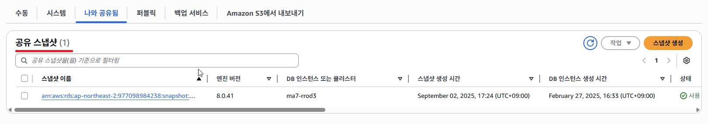

스냅샷을 만들고 옮길 계정에 해당 스냅샷을 공유까지는 했는데

해당 스냅샷을 새 계정에서 복원 시키려는 순간

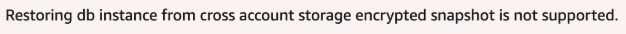

위와 같은 에러가 떴다.

"교차 계정 스토리지 암호화된 스냅샷에서 DB 인스턴스를 복원하는 것은 지원되지 않습니다."

좀 풀어서 얘기하자면 암호화된 스냅샷을 공유하여 복원하는건 지원되지 않는다고 뜬다.

?? 난 여지껏 되는줄 알았는데...

좀 더 알아보았다.

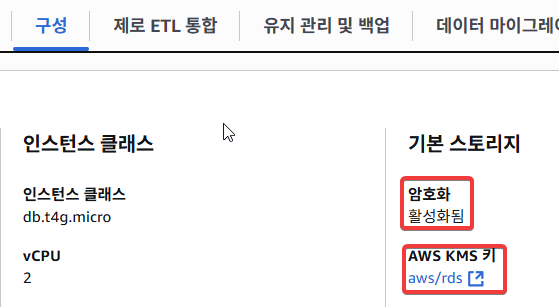

현재 내 DB는 암호화가 활성화 된 상태였다. 그것도 AWS KMS Key로.

무슨 Key로 암호화 됐길래 그렇지? 하면서 좀 더 들어가서 확인해보면

억..

암호화된 AWS DB 스냅샷 공유 관련 [공식문서](https://docs.aws.amazon.com/AmazonRDS/latest/UserGuide/share-encrypted-snapshot.html?utm_source=chatgpt.com)를 찾아보면 이런 말이 있다.

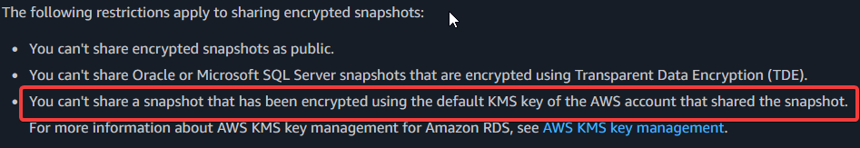

"당신은 공유할 수 없다. 스냅샷을. 스냅샷을 공유한 AWS계정의 기본 KMS 키로 암호화된."

(여기서 기본 키는 AWS가 관리하는 Key를 말한다. AWS 관리형 키)

방법은 없었다. 고객 관리형 키를 이용해서 애초부터 그 키로 암호화 시켰다면 이것의 권한 설정 및 공유를 통해 다른 계정과 스냅샷을 공유 할수 있었다.

하지만 현재 상황은 AWS 관리형 키로 암호화 된 상태이기에, 스냅샷을 통한 공유 자체가 불가능 했다.

때문에 다른 방법을 택해야 했다.

### 무슨 방법?

MySQL 자체는 dump라는 기능을 제공한다. 해당 기능은 Database의 data를 전부 SQL파일로 만들어서 일종의 백업본을 만드는 기능이다.

해당 기능을 통해 작업을 다시 진행했다.

자주 사용하는 DBeaver는 해당 기능을 지원해줬다.

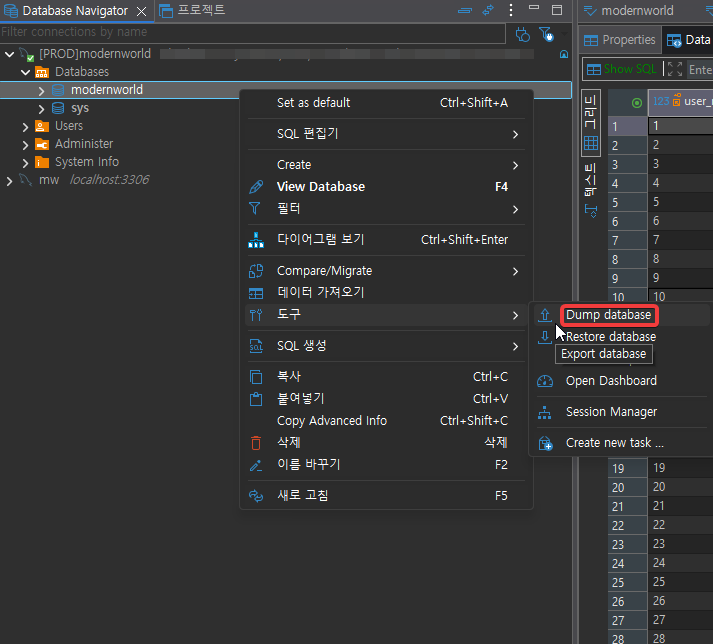

dump 파일 슥슥 받아서 작업이 완료되면,

다음과 같이 SQL문으로 된 파일이 생성된다.

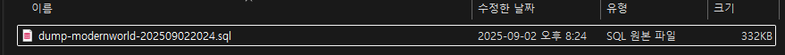
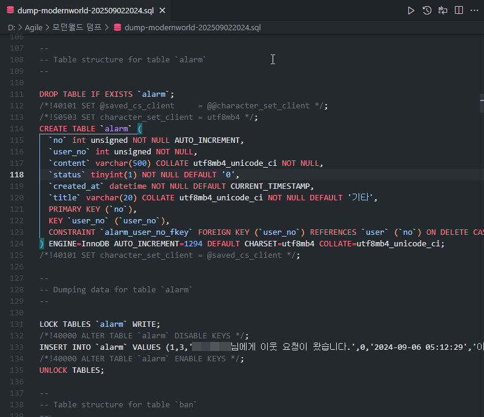

자세히 보면 DDL 뿐만이 아니라 DCL도 같이 들어가 있는걸 볼 수 있다.

단순하게 기존에 우리가 사용했던 SQL문을 이용해서 data를 구축 할 수 있다는걸 깨달았다.

이렇게 dump 파일까지 만들어 두었으면 본격적으로 새로운 인프라를 생성해야 한다.

### 문제사항

여기서 문제가 [참고자료](https://aws.amazon.com/ko/blogs/aws/new-aws-public-ipv4-address-charge-public-ip-insights/?utm_source=chatgpt.com)를 보면 RDS의 경우 2024년 2월 1일부로 할당된 Public IPv4 주소에 요금을 부과하기 시작했다. 나같은 ~~거지~~ 학생에게는 정말 눈물나게 고마운 일이다.

때문에 지금부터 할 일은 이렇다. AWS의 VPC(가상 사설 클라우드)를 통해 우리는 사설 네트워크를 클라우드에서 가상으로 구축 할 수 있다. 다음 그림을 보자.

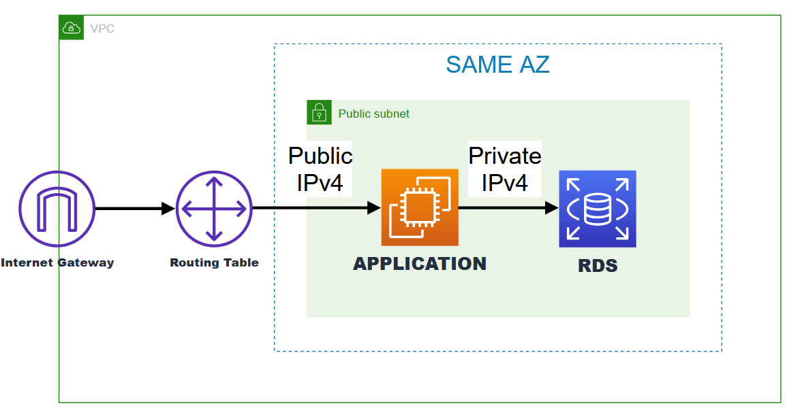

그림을 보면 같은 AZ에 있는 서브넷을 사용하고 있는걸로 보인다.

AZ가 서로 다르면 AZ 간 통신 비용이 소량이지만 부과 될것이다. 때문에 같은 AZ에 인프라를 위치 시켜야 하며, 네트워크를 위해 인프라를 동일한 Subnet에 두었다.

EC2와 RDS 간 통신은 Private IPv4를 이용하여 통신하게 됨으로, 최종적으로 RDS의 Public IPv4 요금이 나가지 않게된다.

결과적으로 Public IPv4 주소를 사용하는 부분은 EC2 (Elastic IP) 하나 뿐이다.

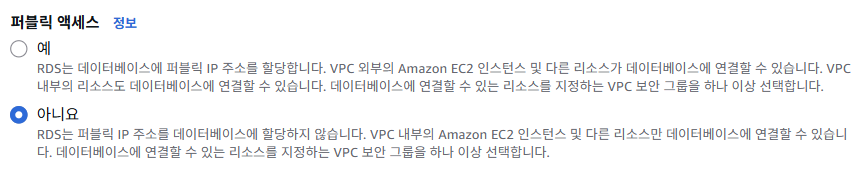

이를 위해서 RDS는 절대로 Public IPv4 주소를 할당받으면 안된다.

RDS를 구축할 때 아래와 같이 해당 부분을 선택하자.

AZ도 중요하다. VPC를 잘 설정해서 VPC의 각 서브넷이 내가 원하는 AZ에 있는지 확인한 후

있다면 해당 가용영역을 선택하면 된다. 아까도 말했지만 비용을 최대한 절약하기 위해서 같은 AZ에 인프라를 생성할 것이다. 덤으로 각 인프라도 동일한 서브넷에서 관리하면 편할 것이다.

어차피 다른 서브넷에 둘 이유도 없고말이다.

사실 이 구조도 충분하고 나 역시 빨리 구축하고 싶었던 마음이 컸기 때문에 해당 구조를 채택해서 가져가긴 했다. 하지만 해당 구조는 치명적인 문제가 있다.

바로 Public Subnet에서 Database가 구축됐다. 언제든지 외부 인터넷에 접근할 수 있다는 말이다.

**물론** Public IPv4 주소가 존재하지 않기 때문에 외부에서 해당 인프라에 **직접** 접근 할 수단은 없다.

지금 상황이 어떤 느낌이냐면, JAVA에서 객체를 만들 때, Public Method를 만들어놓고 아무런 기능을 하지 않는 상황을 만들어 놓은것이다.

하지만 해당 Method가 Public 상태이기 때문에 어느곳에서나 해당 객체를 사용할때 Method를 사용할 수가 있는것이다. (아무런 기능을 하지 않는 상태임에도)

애초부터 private Method로 만들었으면 해당 메서드는 절대 밖에서 쓰일 일이 없었을 텐데말이다.

얘기가 길어졌지만 핵심은 이거다.

좋은 개발은 '제약'이 있는 개발이다. 다음을 보자.

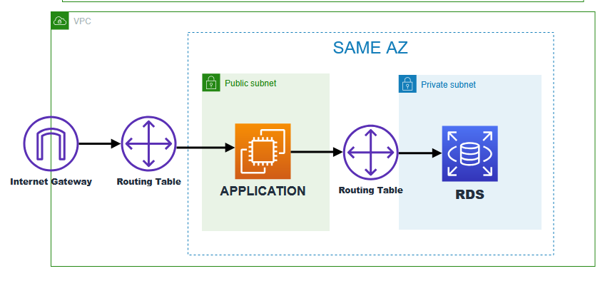

RDS는 외부 인터넷에 절대 노출되지 않는다. 즉, 외부에서 RDS에 접근 할 수 있는 방법이 없다.

Public Subnet의 경우 인터넷 게이트웨이와 연결돼 있기 때문에 인터넷과 노출돼 있다고 보면된다.

하지만 Private Subnet은 게이트웨이와 연결돼 있지 않기 때문에 해당 문제에서 자유롭다. 절대 인터넷과 통신이 불가능한 곳이다.

EC2와의 통신은 VPC 내부에서만 사용되는 Private IPv4 주소를 이용하여 통신이 가능하다. 해당 IP는 내부 망에서 사용하는 것이기에 요금이 들지 않는다. 내가 할당하는건 아니고, AWS가 자동으로 할당해준다. 라우팅 테이블을 또 따로 설정하지 않아도 되는게, 이것 또한 AWS가 자동으로 설정해준다.

이렇게 되면 RDS가 외부와 통신할 일말의 기회조차 주지 않게된다. 좋은 설계다.

인프라 설계 얘기는 여기까지 하겠다.

다시 말하지만 후자의 방법으로 구축하지는 못했다. 할수는 있었는데 순간 까먹었다... 이미 인프라가 다 구축된 상태 이기 때문에 당분간은 이렇게 두려고 한다.

### 다시 본론으로

이제 만든 dump 파일을 새로 생성한 RDS에 넣어주면

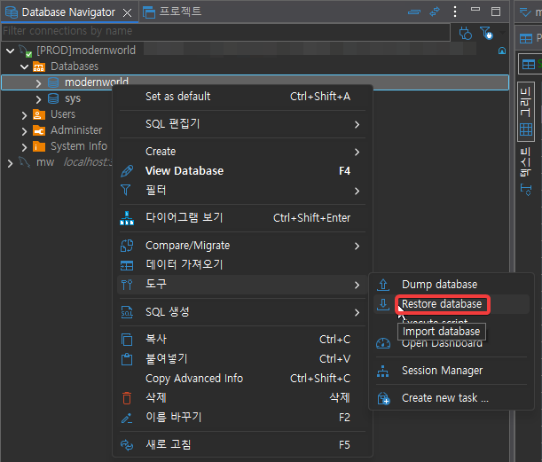

순조롭게 복구 시킬 수 있다.

복사한 data가 정상적으로 잘 복사가 됐는지 인덱싱, 테블 간 키 관계, 타임존 등 만 확인을 했고 모든 상태가 정상적인걸 파악했다.

이제 RDS 마이그레이션은 끝났다. 다음은 S3!

---

## S3

S3는 RDS와는 다르게 스냅샷 개념이 없다.

대신 버킷을 통째로 복사하는 방법이 존재한다.

AWS의 CLI를 이용하는 방법이 존재했으나, UI를 통한 마이그레이션 방법을 택하기로 했다.

일단 당연하겠지만 복사본을 받을 객체 S3 버킷 자체를 새로운 계정에서 생성해야 한다.

버킷을 일단 만들었다고 해서 바로 마이그레이션 작업을 수행할 수는 없다.

새로운 버킷은 정책 / 권한을 꼭 설정해 주어야 한다. 관련 권한 설정도 UI로 할수 있다.

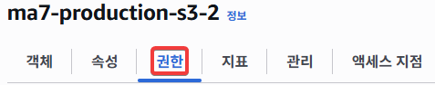

일단 기존 버킷으로부터 파일을 받을 수 있게 문부터 열어줘야 하는게 필수다.

해당 사항은 버킷의 정책 탭에서 변경 할 수 있다.

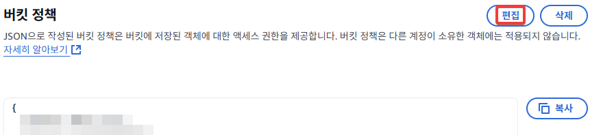

정책 관련해서는 혼자서 도저히 어쩔 방법이 없다. 수많은 정책을 많이 만져본것도 아니고 각잡고 공부한것도 아니기에, GPT의 도움을 받아서 작성했다.

자세한 설명은 아래를 펼쳐보기를 바란다.

  
 정책 설명 

Version은 말 그대로 정책을 사용할 정책 버전이다. 이거 말고 쓰는걸 본적은 없다.

Statement는 정책의 실제 내용이 들어가는 부분이다.

Sid는 Statement ID의 약자이다. 정책 내에서 statement를 구분하기 위한 식별자 역할을 한다. 크게 의미는 없다.

Effect는 해당 정책이 허용인지 거부인지를 설정하는 부분이다. Allow 또는 Deny의 값을 갖는데 해당 값에 따라 해당 기능을 적용할지 말지가 결정된다.

Principal은 정책이 적용되는 주체를 지정하는 부분이다. AWS 서비스, 특정 사용자, 역할 등을 지정할 수 있다. 여기서는 모든 이전 계정의 모든 사용자를 의미하는 "AWS": "arn:aws:ima::<OLD_ACCOUNT_ID>:root"로 설정했다.

Action은 정책이 허용하거나 거부하는 작업을 지정하는 부분이다. 여기서는 S3 버킷과 객체에 대한 작업인 다음의 내용을 할당했다.

s3:ListBucket : 버킷의 객체 목록 조회
s3:ListBucketMultipartUploads : 버킷에서 진행 중인 멀티파트 업로드(MPU) 목록 조회.
s3:PutObject : 파일 업로드/덮어쓰기 권한.
s3:AbortMultipartUpload : 멀티파트 업로드 중단/정리.

Resource는 정책이 적용되는 리소스를 지정하는 부분이다. 여기서는 특정 버킷과 그 안의 모든 객체를 의미하는 "arn:aws:s3:::<NEW_BUCKET_NAME>" 및 "arn:aws:s3:::<NEW_BUCKET_NAME>/\*"로 설정했다.

남은건 원본 버킷에서 새롭게 만든 버킷으로 모든 객체를 옮기는 것뿐이었다.

작업은 매우 간단하다.

원본 버킷에서

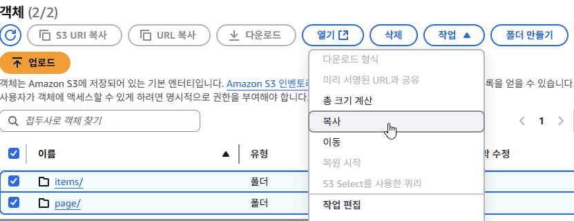

슥

슥 복사해 주었다.

그런데..

문제가 발생했다.

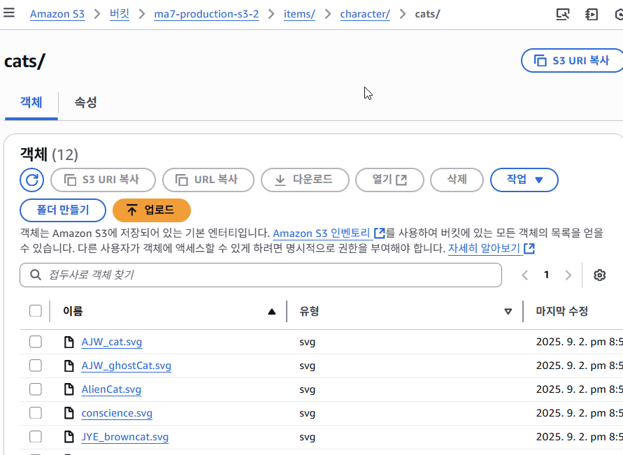

아무튼 객체는 잘 복사됐으니까 좋아쓰!!!

가 아니라

객체 자체가 손상되거나 접근이 잘 안되지는 않았기에 따로 설정하지는 않았다.

정확히 무슨 문제인지 정확히는 파악하지 못했지만 GPT의 도움을 받아서 대략적으로 문제를 파악했다.

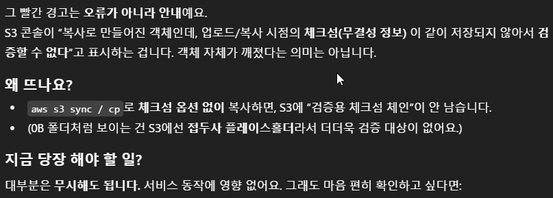

체크섬 관련 에러인듯 싶다.

근데 막상 객체 자체에 접근해보면 체크섬 정보는 잘 저장돼 있는데...

해당 부분은 나중에 한번더 알아 보도록 하겠다.

마지막으로 남은건 아제 하나였다.

애초의 본 S3의 용도는 우리 서비스에서 정적파일, 즉 이미지 파일을 모든이에게 보여주기 위해서 존재하는 저장소 였다.

때문에 S3 자체를 누구나 조회 할 수 있어도 상관은 없었다. 개인이 보관해야 할 민감정보나 사적 정보는 들어있지 않다.

그렇기에 다시한번 정책을 손봐야 했다. 이 상태로 버킷을 냅두면 아무도 우리 버킷에 있는 객체들에 접근 할 수가 없기 때문이다.

최종적으로 다음과 같이 설정했다.

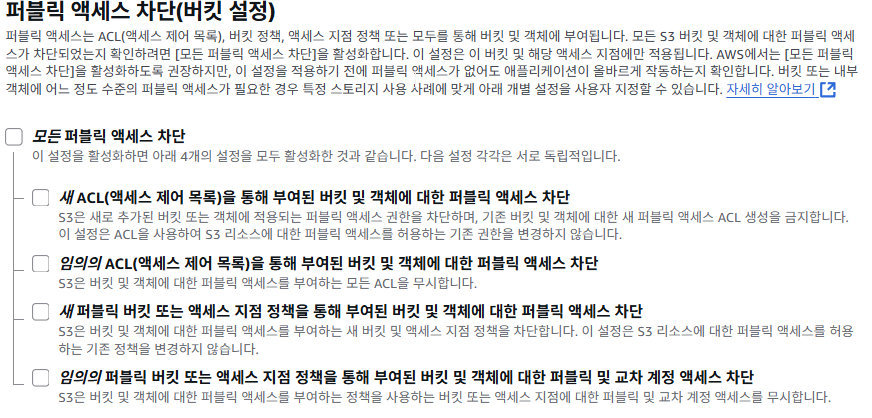

퍼블릭 액세스 차단을 설정할 필요가 없기에 전부 체크해제 하였고.

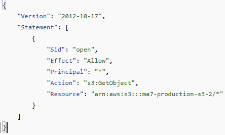

모든이가 우리 버킷의 모든 객체에 접근 할 수 있도록 열어주었다.

이제 S3 마이그레이션 작업도 끝났다. 다음은 EC2!

---

## EC2 (Back-end)

EC2는 RDS와 S3와는 다르게 마이그레이션 방법이 다양했다.

AMI를 이용한 방법, EBS를 이용한 방법, 직접 내부 파일 빼내서 옮겨 심기 등

처음에는 EBS를 이용해서 EBS의 스냅샷 만들어 복사해서 다른 계정에 옮기려고 했는데

생각해보니까 굳이 그럴 필요가 있나 싶기도 했다.

어차피 관련 설정 파일은 폴더 하나에 몰아 두어서 해당 폴더만 내 로컬PC로 백업 해 두고 새 EC2에 복사만 제대로 해두면 끝이나는 상황이었다.

RDS에서 설명했듯이 RDS와 동일한 AZ에 인프라를 만들어야 했다.

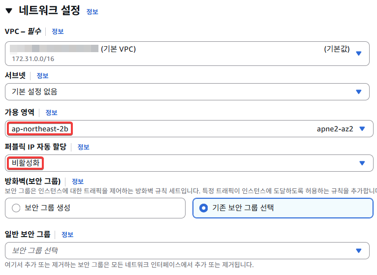

따로 서브넷을 설정해 주지 않으면 가용영역을 기준으로 해당 가용영역에 위치한 Public Subnet 중 하나가 배정되게 된다. 특정 서브넷에 해당 자원이 배치되게 하고싶다면, 서브넷을 특정해주면 된다.

퍼블릭 IPv4 자동할당 옵션은 해당 인스턴스에는 Elastic IP를 할당해 줄거라 비활성화 했다.

서버의 방화벽 역할을 할 보안그룹은 상당히 중요한데, 따로 생성해도 좋고 기존 보안 그룹이 잘 돼있다면 선택해도 좋다.

우선 인바운드 규칙으로 SSH를 위한 22, HTTP, HTTPS를 위해 각각 80, 443 을 열어두었다.

아웃바운드 규칙은 크게 중요하지 않았기에 기본설정인 모든 트래픽을 열어 두었다.

그렇게 해서 인스턴스를 생성하면, 이제 Elastic IP를 할당시켜주었다. 서버를 껐다 켜도 이제는 IP가 변경되지 않는다.

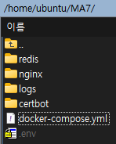

그렇게 해서 서버 구축에 필요한 docker-comopse, redis, nginx, env 파일을 넣었고

바로 이미지만 싸게싸게 땡겨와서
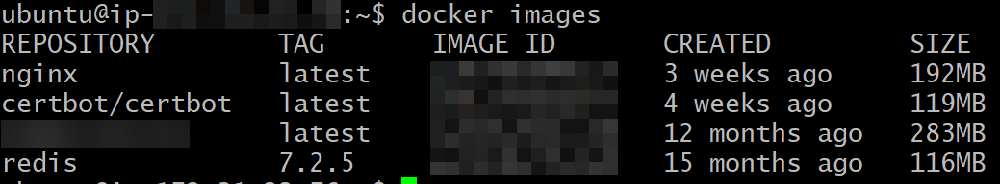

docker compose 를 이용해서 서비스 정상화를 시켰다.

이때 살짝 간과하고 있었던 사실이 있었는데 DB(RDS) 접근 자체가 이뤄지지 않고 있었다.

바로 보안그룹때문이란 걸 떠올렸다. 특정 EC2 Instance가 RDS에 접근하려면 해당 RDS의 보안그룹을 바꿔주어야 한다.

정말 간편하게도, AWS는 해당 EC2 - RDS 간 연결 문제를 UI로 손쉽게 수정할 수 있도록 도와준다.
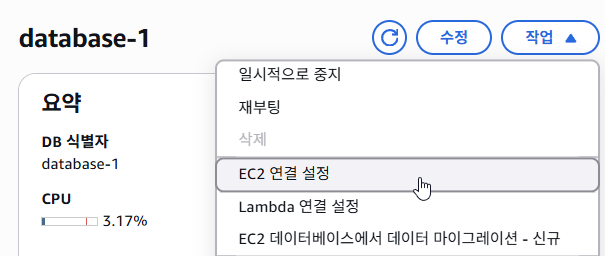

연결 설정에 들어가서

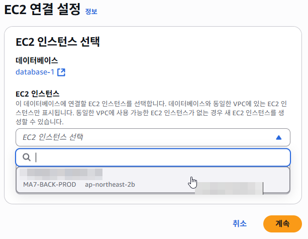

내가 원하는 EC2 인스턴스를 선택 하기만 하면 상호간 인바운드 / 아웃바운드 규칙이 만들어진다.

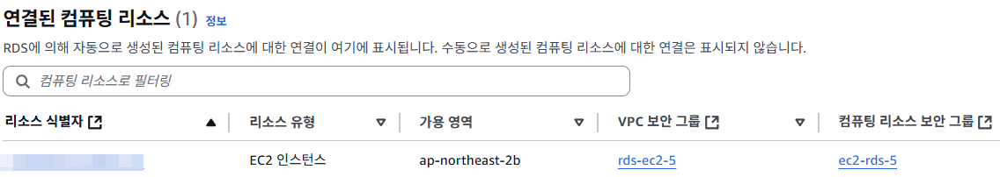

요로코롬.

이렇게 되면, 이제 정상적으로 통신이 되는걸 볼 수 있었다.

마지막으로 Front-end 구축이 남았다.

---

## EC2 (Front-end)

Front-end는 Back-end와 마찬가지로 또 다른 계정의 Ec2 Instance로 서비스를 제공하고 있었는데, 이 역시 이번주 까지가 프리티어 기간이 남아 있었다.

어차피 프론트엔드의 주 역할이 사용자에게 페이지를 제공하는 것 뿐이라서 지금 상황에서 Server를 굳이 한 더 놓는건 의미가 없어 보였다. 따라서

Netlify라는 정적자원 호스팅 사이트를 이용해 인프라를 구축했다.

AWS를 이용하지 않았기 때문에 env나 도메인 연결등 기초적인 작업만 착착 해주면 손쉽게 사이트를 제공할 수 있었다.

Netlify 구축을 위해 Netlify 라이브러리를 받은 후 관련 설정파일을 레포지토리에 넣어주었다.
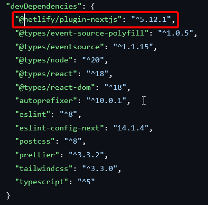

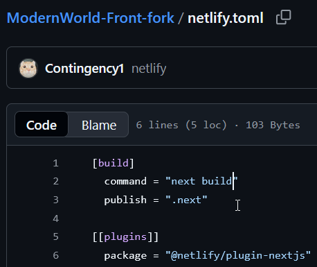

프론트엔드가 Next.js 프레임워크 기반이다 보니 서버를 실행할 때 관련 명령어들을 명시해 놓았다.

Netlify 자체는 레포지토리랑 바로 연결이 되고
개발자가 따로 CICD 같은걸 설정 할 필요 없이,

정말 최소한의 관리만 하면 될 정도로 손볼 일이 거의 없었다.
때문에 정말 간편하게 서버 구축이 가능했다.

변경사항이 감지되면 알아서 배포까지 일사천리로 진행이 되었기에 남은건 도메인 연결만 DNS 사이트에서 CNAME 레코드로 매핑 해주고

해당 도메인을 수용할 수 있도록 도메인 설정까지 Netlify에 추가해 주면 진짜 끝이 나게 되었다.

모든 일이 순조로웠지만 막상 사이트에 접속하니 S3로 부터 오는 이미지들을 볼 수 없었다.

### 또 문제사항

문제는 사진을 찍어두지는 않았지만 DB를 처음 설계할때 하자가 있었다. 정확히는 data 관련 문제였다.

일단 문제의 data를 보면

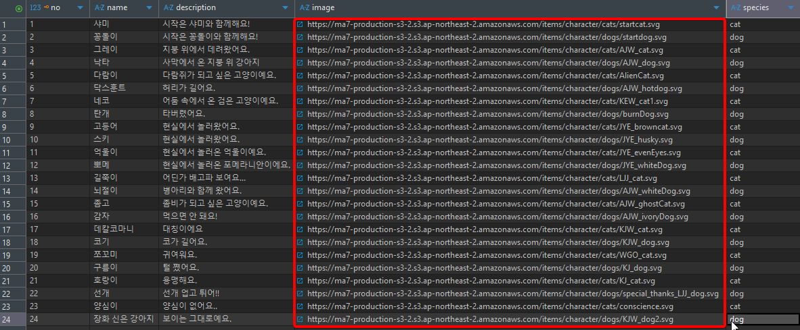

아는 사람들은 눈치 챘을 것이다.

사진의 URL이 절대경로로 되어 있다.

https://ma7-production-s3-2.s3.ap-northeast-2.amazonaws.com/폴더...

이런식으로 되어 있다.

이미 S3는 이전이 완료가 된 상태라서 기존의 S3 버킷은 삭제가 된 상태이다. 따라서 새로운 S3 버킷의 주소를 할당 시켜주어야 하는데...

상대경로로 되어 있었다면 앞의 경로만 front나 back에서 환경변수같은 것으로 관리만 해주면 됐을 것이다.

이것을 보고 해당 부분의 설계가 완전히 잘못됐다고 생각했다. 완전히 나의 불찰이다.

개인적으로 이걸 보고 상당히 충격을 먹었다.

그래도 data 그렇게 많지 않아서 다행이었다. 100개 정도의 data를 모두 직접 변경했지만 구조적 문제가 있었단 걸 뒤늦게 깨달은 순간이었다.

다음부터는 상대경로로 data를 집어 넣는걸 강력히 고려해야겠다는 생각이 들었다. 과거의 내가 왜 그랬는지는 모르겠지만.

---

## 마무리

이렇게 해서 모든 마이그레이션 작업이 끝났다.

마지막으로 내가 만든 설계 구조에 대해서 설명할게 남아 있다.

(아까도 언급했지만, 현재 이렇게 구축돼 있지는 않다. RDS가 Public Subnet에 위치해 있다.)

내가 여기서 말하고싶은건, Public IPv4 주소가 존재하지 않는 RDS는 이제 더 이상 우리의 local PC에서 RDS EndPoint를 통해 **직접**접근 하는 것은 불가능 하다.

현재의 RDS에 접근가능 한 유일한 인프라는 Ec2 Instance 하나밖에 없다.

그렇기에 PC(local) -> EC2 Instacne -> RDS의 방법을 택해야 한다.

우선 EC2에 접근하기 위한 user Id, password, Ip, (접속을 위한) pem or ppk Key 가 필요하고.

EC2에서 RDS에 접근하기 위한 user Id, password, EndPoint, Port 가 필요하다.

개발 환경에서 DB에 직접 접근할 필요가 있을 수 있기 때문에, 해당 기능을 알고는 있어야 한다고 생각했다.

정말 고맙게도 DBeaver는 해당 편의 기능을 구현해 주었다.

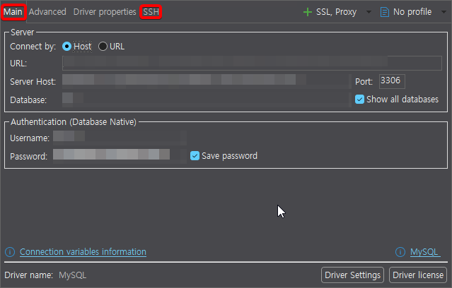

RDS 접근을 위한 경로 설정과

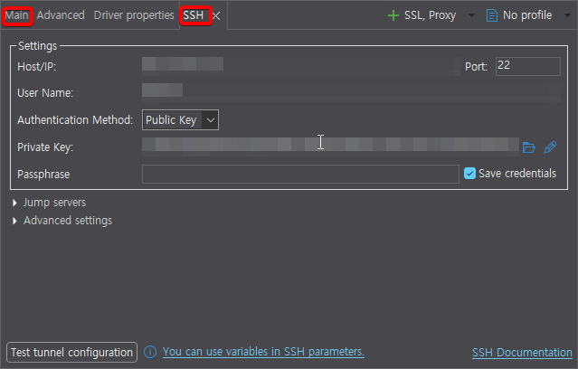

EC2 접근을 위한 경로 설정까지 해주면 완성이다.

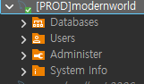

이제 RDS에 접근 할 수 있다.

좀 전문 용어를 쓰자면 이런 식의 구조가 바스티온 호스트라고도 하는 것 같다. 관리를 위한 목적으로 EC2를 통해 우회해서 RDS에 접근 할 수 있기 때문이다.

그러나, application 서비스 제공기능과 DB 관리 기능을 동일한 인스턴스에서 하면 좋지 않다고 알고있다.

보안상 취약점이 있을 수 있기 때문이다. 따라서 진짜 실무같은 곳에서는 이런 구조(Applcation + DB Management)를 하나의 인스턴스에서 하게끔 쓰고 있지는 않을것이다.

---

## 진짜 마무리

내가 걸었던 마이그레이션 작업을 전부 작성하는게 끝이 났다.

시작은 단순히 프리티어 기간이 만료된 계정을 다른 새로운 계정에 옮기는 것 뿐이었는데

처음 생각과 거의 동일하게 시간이 걸렸던 것 같다.

솔직히 자금의 여유가 된다면 이런저런 AWS의 서비스를 마구잡이로 사용해보고 싶은 욕심이 있다.

더 좋은 설계도 해보고 싶다.

하지만 현실은 녹록치 않다. 아직도 많이 부족하다. 이상은 높기만 한것같다.

그래도 오늘도 나는 갈 길 간다.

끝까지 읽어줘서 고맙다.
