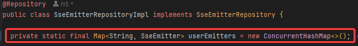
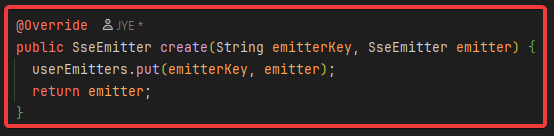
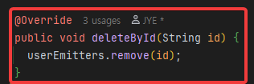
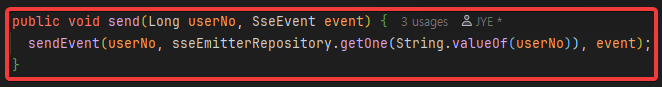
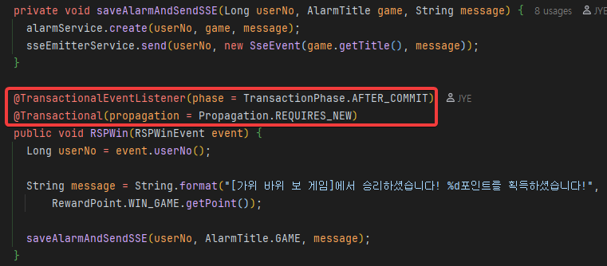
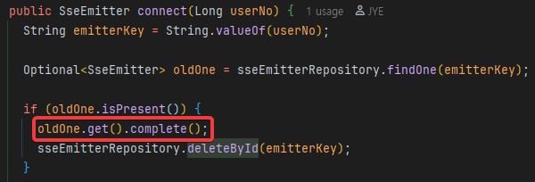
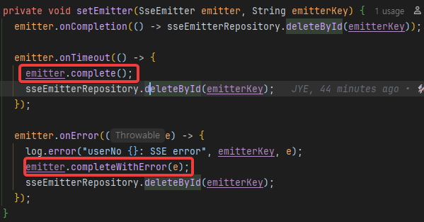
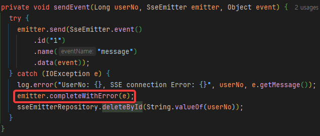
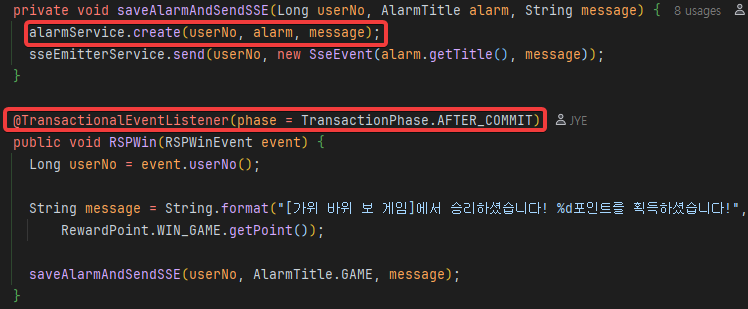
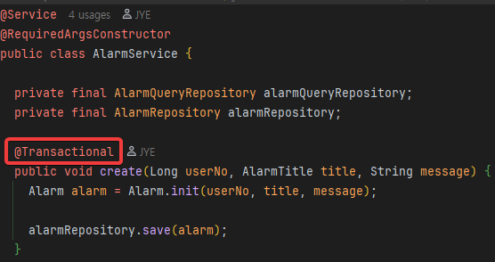

## 문제의 인식

[개인 프로젝트](https://github.com/Contingency1/ModernWorldV2)를 마치고 난 후, 서버에 해당 Application을 띄운후 깨달은게 하나 있다.

하루에 한번씩 서버를 확인하려고 htop을 딱 치는 순간, 메모리 사용량이 조금씩 늘어나고 있었고, 2 ~ 3일 지난후 어느 순간 내 서버는 접속자체가 안됐다.

초기 2~3일 정도는 이렇게 생각했다. 단순히 JAVA / Spring Boot의 메모리 사용량이 많다고 말이다.

때문에 Swap Memory를 설정하여 가용 메모리를 늘리기만 하면 될것이라 판단 후, 바로 실행에 옮겼다.

그 후, 2주간 계속해서 서버의 메모리 사용량을 주시했다.

하지만 메모리 사용량은 여전히 내 예상치를 여전히 뛰어넘고 지속해서 소량씩 증가하고 있었다.

초기 600~700 [MB], 정도 차지하던 메모리는 최근엔 1 [GB] 정도의 메모리를 차지하고 있었다.

이는 근본적으로 Application 자체에 메모리 누수 현상이 발생하고 있다는 걸 증명해주는 셈이라 생각했기에, 이를 해결하기 위해서 메모리 누수 가능성이 있는 곳을 추려냈다.

## 메모리 누수 문제

### SSE Emitter

기존 SSE 커넥션 관련 객체는 메모리 상에서 관리를 해주고 있었다.

Map객체가 SSE emitter를 value로 품고 있는데, key를 제거하면 해당하는 value인 SSE Emitter 객체 자체에 대한 참조가 사라져서 자동으로 GC 영역에 포함된 후 제거 될 줄 알았다.

key를 통해 SSE Emitter 객체를 생성

단순히 key를 통해 해당하는 참조를 제거 = GC 대상이 되어 자동 삭제 될줄 알았다.

하지만 SSE Emitter 객체는 단순한 POJO가 아니었고 Spring이라는 application 자체가 핸들링 하고 있는게 아니었다. Servlet Containter 쪽에서 다루는 객체여서 자동으로 GC 대상이 되지 않았고, Emitter에 설정된 TTL 값 만큼 해당 Connection이 계속해서 열려 있는 상태였다.

때문에 TTL 값만큼 해당하는 메모리를 차지하는 녀석이 됐고 나는 더 이상 application에서 해당 객체를 직접적으로 관리 할 수 없었다.

다음은 더 가관이다.

### Transaction 흐름을 같이 타는 SSE

핵심적인 문제는 다음에 일어난다.
알람을 저장하는 Transaction 흐름과 같은 흐름을 공유한다.

먼저 다음을 보자.

어노테이션을 보면, 이전의 트랜잭션이 완전히 끝난 후(커밋 이후)에 다음 트랜잭션이 새롭게 시작되는걸 볼수 있다.

여기까지는 좋다. 좋은데, 문제는 이럴때 발생한다. 

당연하지만 SSE Emitter 자체가 정상적으로 동작이 가능하면, SSE를 보내게 되고, 이는 곧 해당 트랜잭션 역시 정상적을 커밋 이후 끝나게 된다.

하지만 정상 동작이 불가능 한 경우에는 이벤트 자체에 흐름이 끊기지 않으면서 **sseEmitterService.send()** 메서드가 네트워크 응답을 기다리는 동안 Thread가 Blocking 상태에 빠지게 된다.

이때 가장 치명적인 문제는, 이 모든 과정이 여전히 살아있는 트랜잭션 안에서 일어나고 있다는 점이다.

네트워크 통신(I/O)이 지연되거나 타임아웃을 기다리는 그 긴 시간 동안, DB Connection 또한 반환되지 못하고 계속 점유된 상태로 묶여 있게 된다.

최종적으로 다음과 같은 **아주 아름다운 장관**이 연쇄적으로 벌어지게 되는데

1. 비정상 Emitter가 늘어남에 따라서 API 요청을 할수록 DB CP(Connection Pool)가 고갈이 될거고 다른 정상적인 DB 요청조차 DB에 접근하지 못해서 서버가 멈추게된다.

2. 트랜잭션이 스레드 블로킹 때문에 멈추게 되면, 일정시간이 되면 timeout 제한시간에 도달해 자동으로 트랜잭션 실패가 일어나게 된다. 이는 곧, data 정합성 문제로 이어지게 된다.

비록 핵심적인 비즈니스 로직에 대한 data 정합성은 아니라서 다행이지만 (이미 이전에 커밋되니까), 알람 자체가 db에 저장이 되지 않아서 Client가 alarm 내역을 보지 못하게 되는건 큰 불편사항중 하나일 것이다.

그리고 Server는 Server대로 불필요한 메모리를 계속해서 유지시켜야 하는것도 정말 치명적이다.

따라서 다음과 같은 해결 방안을 두었다.

## 해결책

### SSE Emitter

emiitter 관련 해결책은 매우 간단하다. Map에서 삭제하기 전에, 해당 emitter의 종료를 Servlet에 알리기 위해 해당 emitter의 complete()메서드를 호출 한 후 Map에서 제거한다.

이렇게 하면 Servlet Container에서 참조하고 있는 emitter 객체가 완전히 삭제 되기 때문에 쓸모없는 메모리를 차지하지 않게된다.

### 트랜잭션

트랜잭션 흐름은 정말 간단하게 제어할수 있다.

anoatation을 보면 이전 커밋이 이뤄진 후 트랜잭션 시작이 해당 메서드 부터 시작하는데, 이 트랜잭션 시작을 alarmService에서 시작하게끔 하면 끝이다. 다음을 보자.

트랜잭션 시작 관련 @Transaction을 제거 한 후,

AlarmService의 메서드에 존재하고 있던 Transactoinal로 새 transaction을 시작한다.

이렇게 되면 흐름은 그림과 같이 바뀌게 된다.

## 배운점과 교훈

이번 사태는 SSE Emitter 자체의 참조를 Servlet Container(Tomcat)도 하고 있다는걸 완전히 인지하지 못하고 기능부터 구현하려 했던 나의 무지함이 매우 크다.

단순히 기본 JAVA 객체처럼 단순 참조만 끊으면 GC가 알아서 동작할줄 알았다.

쉽지 않네