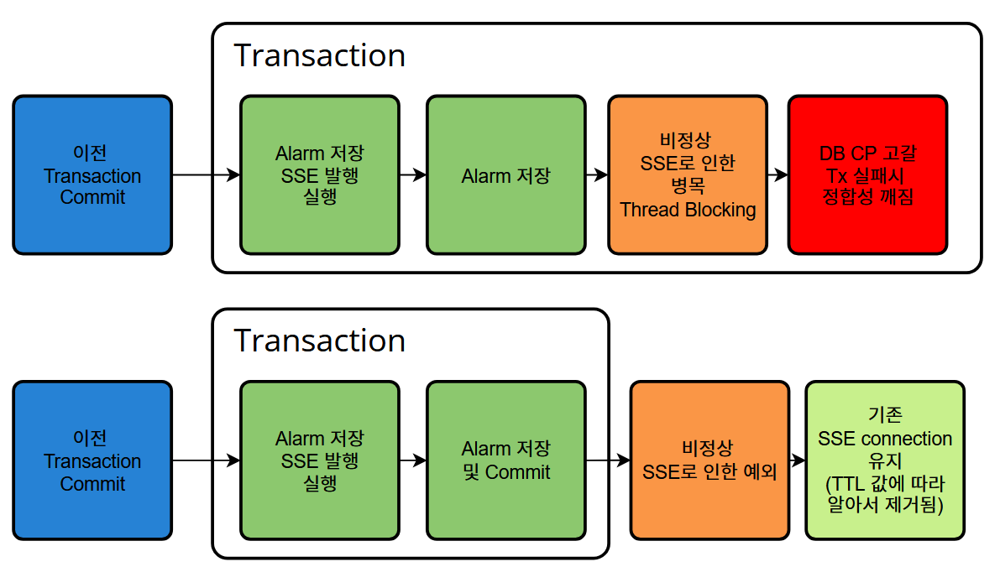
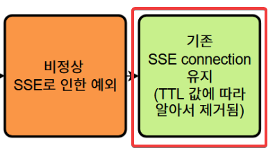
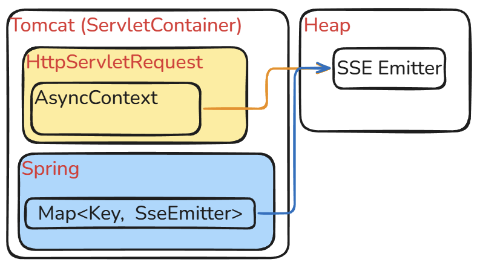
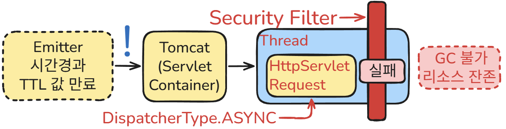
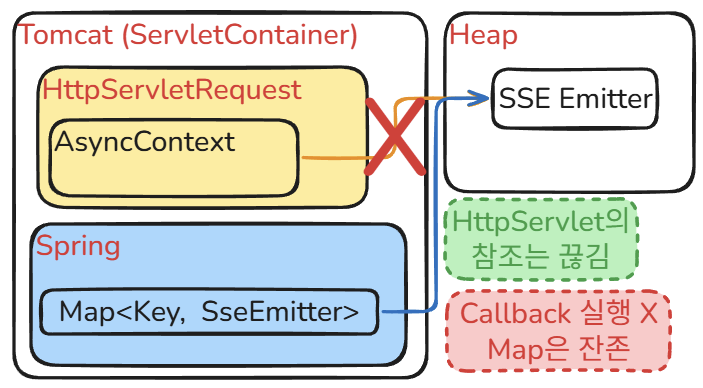
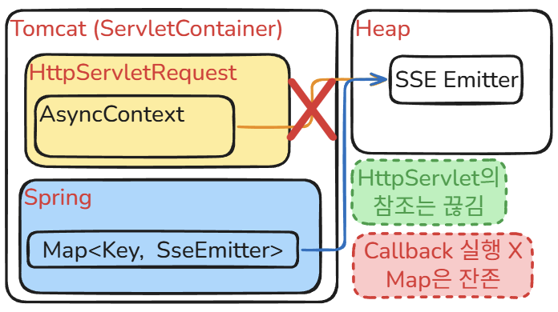

## 문제의 인식

이전 [Post](https://contingency1.github.io/posts/Spring-Boot-Spring%EC%9D%98-SSE-Emitter%EB%A1%9C-%EB%B2%8C%EC%96%B4%EC%A7%84-%EC%9D%B4%EC%8A%88/)에서 정상화된 SSE Emitter 객체를 볼 수 있었을 것이다.

알람도 잘 저장이되고, Client 역시 SSE 이벤트를 문제없이 수신했다.

그런데 이젠 눈에 새롭게 올라오는 Error Log가 있었다.

```bash
2026-02-03T07:57:39.271Z ERROR [nio-8080-exec-3] o.a.c.c.C.[.[.[/].[dispatcherServlet] : 
Servlet.service() for servlet [dispatcherServlet] ... threw exception 
[Unable to handle the Spring Security Exception because the response is already committed.] 
with root cause

org.springframework.security.authorization.AuthorizationDeniedException: Access Denied
    at org.springframework.security.web.access.intercept.AuthorizationFilter.doFilter(AuthorizationFilter.java:99) 
    ...
    at org.apache.catalina.core.AsyncContextImpl$AsyncRunnable.run(AsyncContextImpl.java:599)
    at org.apache.catalina.core.AsyncContextImpl.doInternalDispatch(AsyncContextImpl.java:342) 
    ...
    at org.apache.catalina.connector.CoyoteAdapter.asyncDispatch(CoyoteAdapter.java:239)
    ...
    at java.base/java.lang.Thread.run(Unknown Source)
```

`org.springframework.security.authorization.AuthorizationDeniedException: Access Denied`


`org.springframework.security.web.access.intercept.AuthorizationFilter.doFilter(AuthorizationFilter.java:99) `

아니 Security filter 형님은 왜...? 이게 대체...

### 이전 Post 내용



이전 Post에서 개선을 통해 Transaction과 SSE로직 자체가 분리되어 Transaction 흐름과 별개로 SSE가 동작하는 걸 볼수 있었는데



문제는 이 흐름에 있었다.

## SSE Emitter 생성과 Thread의 동작방식

### 최초 SSE Connection

Client가 요청을 보내면 Tomcat은 Thread Pool에 유휴 Thread 에게 작업을 할당한다.

코드부터 보자.

```java
  public SseEmitter connect(Long userNo) {
    String emitterKey = String.valueOf(userNo);
    ...
    SseEmitter emitter = new SseEmitter(SSE_TTL);
    setEmitter(emitter, emitterKey);
    sseEmitterRepository.create(emitterKey, emitter);
    ...
    return emitter;
  }


//Repository
public class SseEmitterRepositoryImpl implements SseEmitterRepository {

  private final Map<String, SseEmitter> userEmitters = new ConcurrentHashMap<>();

  @Override
  public SseEmitter create(String emitterKey, SseEmitter emitter) {
    userEmitters.put(emitterKey, emitter);
    return emitter;
  }
```

SSE Emitter 객체가 생성이 되면서 Repository에 저장후 해당 객체를 반환해준다.

최종적으로 다음과 같이 SSE Emitter 객체가 생성된다.



그림을 보면 Tomcat은 **HttpServletRequest** 안의 AsyncContext라는 필드를 통해 SSE Emitter 객체를 참조하고 있다.

이는 SSE 연결 특성상 Server - Client의 **연결유지**가 필수적이고(Client에 Event를 전송하려면 반드시 연결을 유지하고 있어야 함.) 객체의 TTL, Error와 같은 **생명주기**를 감시하기 위해 필요한 참조이다. 

해당 참조를 통해 연결 상태 변화를 감지하고, 이를 Spring의 Callback으로 **전파**하여 적절한 후속 처리를 가능하게 한다.

Application 수준에서의 참조가 있어야만 원하는 Event를 특정 Client에게 전할 수 있기 때문에 Spring 역시 `Map<String, SseEmitter>` 형식으로 Emitter 객체를 참조하고 있다.

여기서 알아 두어야 할건, **HttpServletRequest** 객체는 Client의 요청이 끝나더라도 메모리 상에 남아있는다. 당연하겠지만 요청이 끝났다고 해서 메모리에서 제거해버리면 Tomcat이 관리할수 있는 수단이 없다.

여기까지는 좋다. 진짜 문제는 다음부터다.

### TTL에 따른 정리대상 Emitter와 DispatcherType에 대해서

```java
public class SseEmitterService {
  // 10분
  private static final Long SSE_TTL = 10 * 60 * 1000L; 

  public SseEmitter connect(Long userNo) {
    String emitterKey = String.valueOf(userNo);

    Optional<SseEmitter> oldOne = sseEmitterRepository.findOne(emitterKey);

    if (oldOne.isPresent()) {
      sseEmitterRepository.delete(emitterKey, oldOne.get());
      oldOne.get().complete();
    }

    SseEmitter emitter = new SseEmitter(SSE_TTL);
    setEmitter(emitter, emitterKey);

    ...

    return emitter;
  }
  
  private void setEmitter(SseEmitter emitter, String emitterKey) {
    emitter.onCompletion(() -> {
      sseEmitterRepository.delete(emitterKey, emitter);
    });

    emitter.onTimeout(() -> {
      sseEmitterRepository.delete(emitterKey, emitter);
    });

    emitter.onError((e) -> {
      log.error("userNo {}: SSE error", emitterKey, e);
      sseEmitterRepository.delete(emitterKey, emitter);
    });
  }
}
```
*참고: 코드에서 oldOne.isPresent() 체크 후 complete()를 호출하는 이유는, 브라우저 새로고침 등으로 재연결 시 기존의 불필요한 연결을 즉시 끊어 리소스를 정리하기 위함이다.*

SSE Connection을 관리하는 SSE Emitter 객체의 TTL 값을 10분으로 설정해 놓은 상황이다.

이 상황에서 설정해 놓은 TTL값이 다 되면 Tomcat은 다음과 같이 동작한다.

Client의 요청으로 인해 저장해두었던 **HttpServletRequest**를 가져와서 Thread에게 작업을 맡긴다. 앞으로 설명할 **DispatcherType** 이라는 속성을 **ASYNC**로 만든다. 이후의 작업은 다음 그림과 같다.





(그림에는 마치 제 3자, 외부로부터 TTL 값 만료 이벤트를 받아 오는 것처럼 돼 있는데, 실제로는 Emitter의 TTL 값 관리와 타임아웃 감지 모두 Tomcat이 담당한다.)

사전 지식이 필요하기 때문에 **DispatcherType**에 대해서 잠시 알아보자.

작업을 실행하면 Tomcat은 요청 처리의 효율성을 위해 Thread에 할당되는 요청객체(**HttpServletRequest**)에 **DispatcherType**을 설정한다.

**DispatcherType**은 여러 종류가 있지만, 핵심 3가지만 짚고 넘어가자.

- **REQUEST** : Client로부터 최초로 들어온 요청 (외부 -> 내부)
- **ASYNC** : Client 요청이 아닌, 비동기 처리를 수행하기 위해 시스템 내부적으로 다시 dispatch(재진입) 되는 요청 (내부 -> 내부)
- **ERROR** : 요청 처리 중 예외가 발생하여, 컨테이너가 에러 처리를 위해 다시 dispatch하는 요청 (예외 발생 시)

여기까지 알았으면 다 왔다. 정리해보자.

지금의 요청은 내부 TTL 값 만료 이벤트에 따라 발생된 DispatcherType.**ASYNC**이다.

최초의 요청(Connection 연결)은 외부 Client로부터 들어오는 요청인 DispatcherType.**REQUEST**이다.

문제는 여기서 발생한다.


DispatcherType.**REQUEST**의 경우는 (정상적인 요청이라는 가정하에) 외부 Client의 정보(JWT, Session 정보 등)를 SecurityContext에 담을수 있기 때문에 Spring Security에 등록된 Filter를 통과할 수 있다.


하지만 DispatcherType.**ASYNC**의 경우는 그렇지 않다. 이때, 기존 요청을 처리하던 Thread와 다른 Thread가 할당될 수 있으며, Spring Security의 인증 정보(**SecurityContext**)는 기본적으로 **ThreadLocal**에 저장되므로 전파되지 않는다. 즉, ASYNC 요청은 '익명 사용자'의 접근으로 간주되어 필터에서 막히게 된다.

```java
  emitter.onTimeout(() -> {
    sseEmitterRepository.delete(emitterKey, emitter);
  });
```

결과적으로 Filter에서 발생한 예외로 인해 Thread는 해당 Emitter에 저장된 Callback을 통한 작업(Map 요소 제거)을 수행하지 못하게 된다.

이후 Tomcat은 이 예외를 감지하여 즉시 SSE 연결을 종료하고 **HttpServletRequest** 객체를 초기화하여 다른 요청에서 재사용할 수 있도록 반납한다.

다음과 같은 그림이 된다.



**HttpServletRequest**에서의 참조는 이제 끊겼고 Map에서의 참조는 남아있다.

## 결과적으로 메모리 누수

현 상황을 파악하자면, 내부 이벤트로인해 발생하는 **HttpServletRequest**의 **DispatcherType**이 **ASYNC**인 요청들은 제대로 처리가 안되고 있다는 것이다.

Client가 Service에서 접속을 정상적으로 종료하거나, TTL 값에 따라 자연스럽게 Emitter가 삭제되어도 Callback은 실행되지 않기 때문에 Server가 재시작되기 전까지 GC의 수거 대상이 되지 못한 채 힙 메모리에 영원히 남게 된다. 이것이 바로 메모리 누수다.

## 해결방법

해결 방법은 상당히 간단하다. 내부에서 발생한 요청은 Filter에서 검증하지 않도록 Security 설정을 하였다.

```java
  @Bean
  public SecurityFilterChain securityFilterChain(HttpSecurity http) throws Exception {
    http
        ...

        .authorizeHttpRequests(authorize -> authorize
            ...

            .dispatcherTypeMatchers(DispatcherType.ASYNC, DispatcherType.ERROR).permitAll()
            .anyRequest()
            .authenticated()
        );

    return http.build();
  }
```

보안적으로 위험사항이 있다고는 하는데, 사실상 외부 요청도 아니고 내부에서 민감한 data에 대한 작업을 ASYNC로 이뤄지게끔 하지 않기 때문에 심각한 사항은 아니라고 판단하였다.

## 회고

생각보다 원리에 대해서 깨우치느라 상당히 오랜시간이 걸렸다.

왜 SSE Emitter 객체를 Tomcat이 관리하는지 확실히 알게되었다. (Socket, SSE같이 입출력, 즉 Network와 관련된 건 Tomcat이 관리하기 때문, Spring은 비지니스 로직에 대한 상세한 처리 주관)

**HttpServletRequest** 객체가 **DispatcherType**, **AsyncContext** 등 생각보다 많은 부분에서 요청에 대한 정보를 제공해준다는 것 역시 깨달았다.
